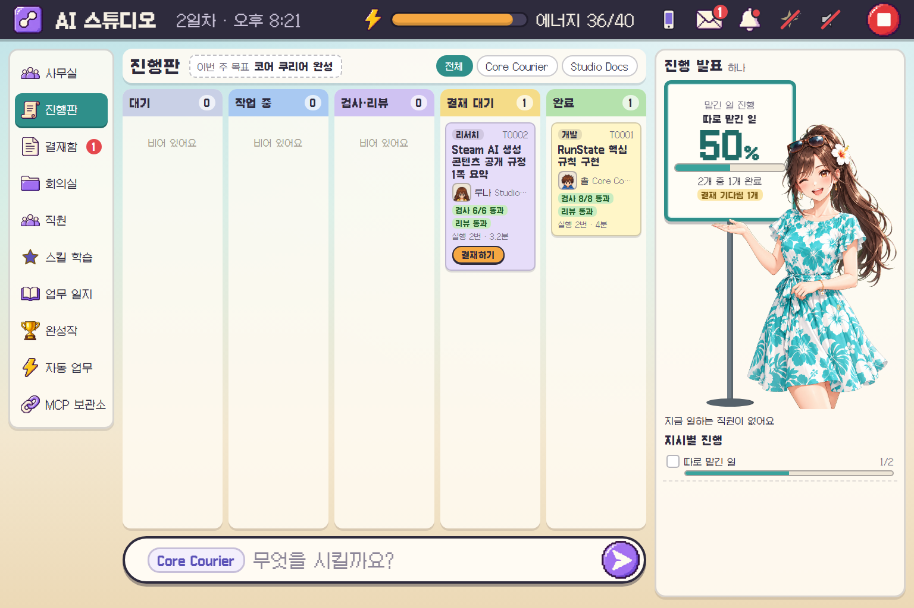

# AI Studio

### AI에게 일을 맡기고, 결과를 확인하고, 직접 승인하는 작업실

`Python 3.11+` · `표준 라이브러리` · `Vanilla JS` · `Codex / Claude Code` · `개인용 프로토타입`

사람이 CEO가 되어 기획·개발·리서치를 지시하는 **로컬 AI 감독 프로그램**입니다. 작업 카드, 실행 기록, 검증 결과와 승인 과정을 한 화면에서 관리합니다. AI 직원은 본인이 구독으로 로그인한 CLI를 사용합니다.

[시작하기](#시작하기) · [일의 흐름](#일의-흐름) · [기능](#주요-기능) · [검증](#테스트와-검증-범위) · [문서](#더-살펴보기)

<p align="center">
  
</p>

*저장소에 포함된 이전 개발 화면입니다. 현재 기본 화면은 진행판이며, 캐릭터·메뉴 구성은 설정과 버전에 따라 다릅니다. 화면 속 수치는 당시 작업 기록입니다.*

## 일의 흐름

**지시 → 기획안 승인 → 구현 → 검증 → 리뷰 → 최종 결재**

| 단계 | 하는 일 | 확인할 근거 |
| :--- | :--- | :--- |
| 01 · 기획 | 읽기 전용 AI가 지시를 작은 작업 카드로 나눕니다 | 작업 범위·완료 조건·선행 작업 |
| 02 · 구현 | 작업별 Git worktree에서 개발·리서치를 진행합니다 | 허용 경로·변경 파일·후보 커밋 |
| 03 · 검증 | 후보 커밋의 깨끗한 사본에서 등록된 검사를 실행합니다 | 실행 명령·검사 결과·증거 파일 |
| 04 · 리뷰 | 읽기 전용 리뷰어가 변경을 검토합니다 | 지적 사항·사용한 실행기·리뷰 결과 |
| 05 · 결재 | 사람이 결과를 보고 승인한 후보를 main에 합칩니다 | 검증한 SHA와 병합한 SHA |

기본 설정에서 기획안은 최대 8개 작업으로 나뉘며, 개발은 초안과 수정 각 1회까지 시도합니다. 검증 실패 내용은 다음 시도의 피드백으로 전달합니다. 상세 규칙은 [회사 운영 안내](company/handbook.md)에 있습니다.

## 주요 기능

| 작업 관리 | AI와 도구 | 화면과 꾸미기 |
| :--- | :--- | :--- |
| 다섯 칸 진행판·결재함·업무 일지 | 역할별 AI·모델·생각 깊이 설정 | 발표 캐릭터와 WebGL 조각 애니메이션 |
| 작업 의존 관계·재시도·긴급 정지 | 직원별 스킬 학습·회고·버전 기록 | 의상·머리색·옷 색·키·체격 조절 |
| 자동 업무·완성작 목록 | 승인한 MCP 연결·도구 제작 | 새 의상·직원 제작 후 승인 |
| 짝지은 휴대폰에서 지시·결재·정지 | 구독 로그인·사용량 상한·실행 기록 | 기본 꺼짐 효과음·한글 도트 글꼴 |

- **직원별 역할:** 기획은 Codex, 개발·리서치는 Codex의 파일 수정 기능, 리뷰는 Claude Code를 기본으로 사용합니다. 리뷰 실행기는 설정에 따라 대체될 수 있습니다.
- **스킬 학습:** `skills/<이름>/SKILL.md`에 지침을 저장하고 다음 작업에 전달합니다. 회고에서 제안한 새 스킬·수정은 승인 후 반영하며 이전 버전은 `history/`에 남깁니다.
- **휴대폰 리모컨:** 같은 와이파이 또는 설정한 Tailscale 경로에서 짝지어진 기기로 접근합니다. CEO는 휴대폰에서도 기존 결재 흐름으로 MCP 설치와 직원 채용을 승인할 수 있습니다. 토큰·설정의 직접 편집 등 나머지 제한은 유지합니다.
- **화면 구성:** 2026-09-30부터 진행판 하나를 기본으로 사용합니다. 사무실 코드와 그림은 보존하며 `#view=office`로 개발용 화면을 열 수 있습니다. F2는 개발용 패널입니다.

### 캐릭터만 먼저 살펴보기

회사 서버나 AI 계정을 실행하지 않고 독립 미리보기를 열 수 있습니다.

```powershell
python docs/design/beach-standing/preview/serve.py
```

브라우저에서 **http://127.0.0.1:8796/** 을 엽니다. 움직임·말하기·정지·좌우 자세·눈과 입을 확인할 수 있습니다.

분리 조각 방식의 해변 발표 캐릭터가 공개본에 포함돼 있습니다. 이 모델은 자체 2D 조각 렌더러를 사용하며 Cubism 모델이 아닙니다. 큰 회전·걷기와 같은 동작에는 원화와 관절 표현의 한계가 있습니다. [구현과 미리보기 안내](docs/design/beach-standing/README.md)를 참고하세요.

## 시작하기

### 1. 필요한 환경

| 준비물 | 용도 |
| :--- | :--- |
| Python 3.11 이상 | 감독 프로그램 실행. 별도 Python 패키지 설치 없음 |
| Git | 제품별 저장소·작업 사본·후보 커밋 관리 |
| 본인이 로그인한 Codex·Claude Code CLI | 실제 AI 직원 실행 |
| Godot | 게임 검증과 이미지 가공. `studio.toml`의 경로를 본인 PC에 맞게 변경 |
| PowerShell 7·Node.js | 개발용 사본 도구·JavaScript 자동 검사에 사용 |

현재 설정과 개발 도구는 **Windows 중심**입니다. 다른 운영체제에서는 CLI 경로와 도구 설정을 따로 확인해야 합니다. 아래 PowerShell 명령은 저장소 루트에서 실행합니다.

### 2. 저장소 받기

```powershell
git clone https://github.com/bagseunggwon30-cyber/ai-studio.git
cd ai-studio
```

`studio.toml`에서 Godot 경로와 직원·모델·실행 한도를 확인합니다. 필요하면 터미널에서 `codex login`, `claude auth login`으로 직접 로그인합니다. 모델 API 키를 넣는 방식은 사용하지 않습니다.

### 3. 작업할 제품 연결하기

이 저장소는 감독 프로그램입니다. **제품 저장소와 프로젝트 설정은 별도로 준비해야 합니다.**

1. 작업할 제품 폴더를 `projects/<이름>/` 아래 준비합니다. 제품은 각각 별도 Git 저장소로 관리합니다.
2. `trusted/projects/<이름>.toml`에 제품 위치·허용 경로·검증 명령을 연결합니다. 설정 구조는 [프로젝트 설정 로더](studio/config.py)와 [테스트용 설정 예시](tests/helpers.py)의 `PROJECT_TOML`을 참고하세요.
3. 초기 작업을 사용할 경우 [첫 작업 목록](company/seed-tasks.json)의 프로젝트 이름도 준비한 제품과 맞는지 확인합니다.
4. 준비한 뒤 초기화와 점검을 실행합니다.

```powershell
python studio.py init
python studio.py doctor
```

`init`은 없는 제품 폴더를 자동으로 만들지 않습니다. 공개본에는 제품 저장소와 `trusted/projects/`의 개인 설정이 포함돼 있지 않습니다.

### 4. 작업실 열기

```powershell
python studio.py serve
```

대시보드 주소는 **http://127.0.0.1:8765/** 입니다. 종료는 `Ctrl+C`입니다.

> [!IMPORTANT]
> 실제 작업을 맡기면 로그인한 AI 서비스의 구독 사용량을 사용합니다. 처음에는 작은 작업으로 시작하고, 검증·리뷰·변경 내용을 읽은 뒤 승인하세요.

## 검증과 승인 원칙

- 작업자는 허용된 제품 경로 안에서 수정하며, 감독 프로그램이 범위 밖 변경을 검사하고 되돌립니다.
- 검증 결과의 후보 SHA와 승인할 후보 SHA가 일치해야 병합합니다. 그 사이 main이 바뀌었으면 다시 작업해야 합니다.
- 자동 검증이 없는 프로젝트는 그 사실을 표시합니다. 리뷰 실행기가 모두 실패한 일반 작업도 사람이 직접 확인하도록 결재에 올라갈 수 있습니다. **결재 대기는 모든 검사가 통과했다는 뜻이 아닙니다.**
- 비정상 종료 뒤 작업 중이던 카드는 자동 재실행하지 않고 막힘으로 전환합니다.
- PC 대시보드는 로컬 주소에서 열리며, Host·요청 토큰을 검사합니다. 휴대폰은 별도 짝짓기와 기기 토큰을 사용합니다.
- 실행 기록·로그인 토큰은 공개 저장소에 포함하지 않습니다. 공개된 `data/assets/mascot/`에는 캐릭터 설정과 완성된 그림만 들어 있습니다.

> [!WARNING]
> Git 작업 분리와 경로 검사는 운영체제 수준의 완전한 격리를 뜻하지 않습니다. 등록한 검증 명령은 로컬에서 코드를 실행하므로 신뢰할 수 있는 프로젝트와 검사 도구를 사용하세요.

## 테스트와 검증 범위

**2026-10-01 · `7f5bcbd`를 기준으로 종료·취소·잠금 처리를 수정한 로컬 코드의 Linux 검사:**

| 전체 | 통과 | 건너뜀 | 실패 |
| :---: | :---: | :---: | :---: |
| 231 | 212 | 19 | 0 |

건너뛴 19개는 Godot 환경이 필요한 검사입니다. 이 결과에는 새 회귀 검사 14개가 포함돼 있습니다. Windows의 실제 프로세스·잠금 처리, 로그인한 AI CLI, 실제 휴대폰 동작은 이 실행에서 확인하지 않았습니다. 이 기록은 로컬 수정본의 결과이며, 게시된 커밋의 CI 통과를 뜻하지 않습니다.

```powershell
# 감독 프로그램
python -m unittest discover -s tests -t .

# 캐릭터·화면 로직 (Node.js 필요)
node tools/dev/puppet_sim.js
node tools/dev/board_sim.js
node tools/dev/beach_rigid_sim.js
```

Python 검사는 작업 흐름·승인·HTTP 경계 등을 다룹니다. 가짜 실행기를 사용하는 검사는 실제 AI 서비스의 연결·출력 품질을 보증하지 않으며, 캐릭터 로직·기하 검사는 실제 브라우저의 모든 시각적 결과를 보증하지 않습니다.

초기 공개 당시 기록은 감독 프로그램 217개, 인형 엔진 31개, 해변 모델 기하 검사 통과입니다. 이는 위 수정 후 검사와 구분되는 이전 기록이며 [캐릭터 검증 문서](docs/design/beach-standing/README.md#검증)에 남겨 두었습니다.

### 가짜 실행기로 화면 확인하기

제품 폴더와 설정을 준비한 개발 환경에서 **회사 사본**을 만들어 사용합니다.

```powershell
pwsh tools/dev/fake-company.ps1 -Reset
pwsh tools/dev/fake-company.ps1 -Serve -Port 8793
```

> [!WARNING]
> `serve --fake`도 승인하면 가짜 변경을 제품 저장소에 병합합니다. 실제 회사 폴더에서 실행하지 마세요. `-Reset`은 기존 임시 사본을 지우고 다시 만듭니다.

## 프로젝트 구조

```text
ai-studio/
├── studio.py, studio/   작업 흐름·실행기·검증·서버
├── studio.toml         직원·실행 한도·도구 설정
├── ui/                 진행판·팝업·캐릭터 렌더러·화면 자산
├── company/            회사 규칙·역할·결정 기록·첫 작업
├── skills/             직원에게 전달하는 작업 지침
├── trusted/            프로젝트 설정·신뢰 수용 검사
├── projects/           별도로 준비하는 제품 Git 저장소
├── data/               작업 카드·실행 기록·검증 증거
├── worktrees/          작업별 Git 사본
├── assets-raw/         그림 원본
├── tools/              이미지 가공·개발용 검사 도구
└── tests/              감독 프로그램 테스트
```

감독 프로그램은 Python 표준 라이브러리, 화면은 바닐라 HTML/CSS/JavaScript를 사용합니다. 외부 CDN을 사용하지 않습니다. 글꼴은 Galmuri11이며 [SIL Open Font License](ui/assets/fonts/Galmuri-OFL.txt)를 따릅니다. 예전 관리 화면 `ui-old/`는 공개본에 포함하지 않습니다.

## 명령과 문제 해결

| 명령 | 설명 |
| :--- | :--- |
| `python studio.py serve` | 대시보드와 작업자 실행 |
| `python studio.py doctor` | 도구·로그인·제품 상태 점검 |
| `python studio.py init` | 준비된 제품 저장소·첫 작업 초기화 |
| `python studio.py selftest core-courier` | 준비된 프로젝트의 검사가 결함 구현을 잡는지 확인 |
| `python studio.py status` | 작업 목록 출력 |

- **로그인 필요:** 터미널에서 `codex login` 또는 `claude auth login` 후 재시도합니다.
- **구독 사용 한도:** 한도가 풀린 뒤 재개하고 재시도합니다. API로 우회하지 않습니다.
- **감독 프로그램이 이미 실행 중:** 다른 창의 `serve`를 먼저 종료합니다.
- **실행 결과 확인:** `data/runs/<실행ID>/`의 프롬프트·로그와 `data/qa/<검증ID>/evidence.json`을 확인합니다.

## 더 살펴보기

- [회사 운영 안내](company/handbook.md) · [전체 계획](docs/PLAN.md)
- [화면 설계](docs/design/README.md) · [세부 설계와 진행 기록](docs/design/SPEC.md)
- [캐릭터 구현·독립 미리보기](docs/design/beach-standing/README.md)
- [개발 작업 규칙](AGENTS.md) · [이어서 개발할 때 읽는 인수인계](docs/HANDOFF.md)

## 외부 감독 MVP (작업 브랜치)

외부 AI가 작업을 제출하고 진행·결과·근거를 조회하는 통로, 단계 저장과 복구, 최대 3개로 제한한 병렬 실행을 추가했습니다. [실행 방법과 연결 범위](docs/SUPERVISOR_MVP.md)를 참고하세요. 실제 외부 비서의 도구 등록과 권한 부여는 별도 단계입니다.
