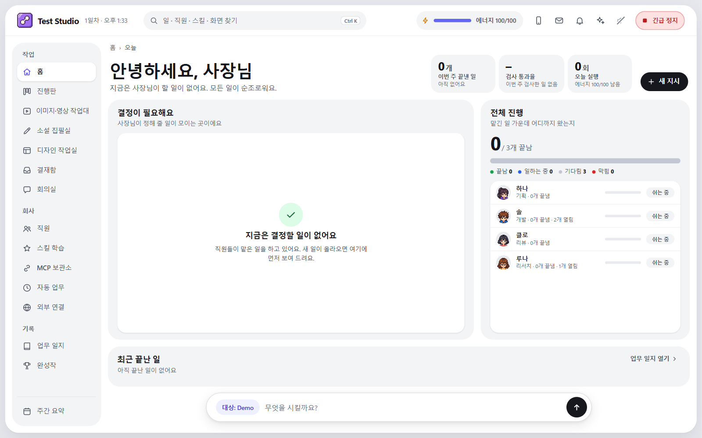
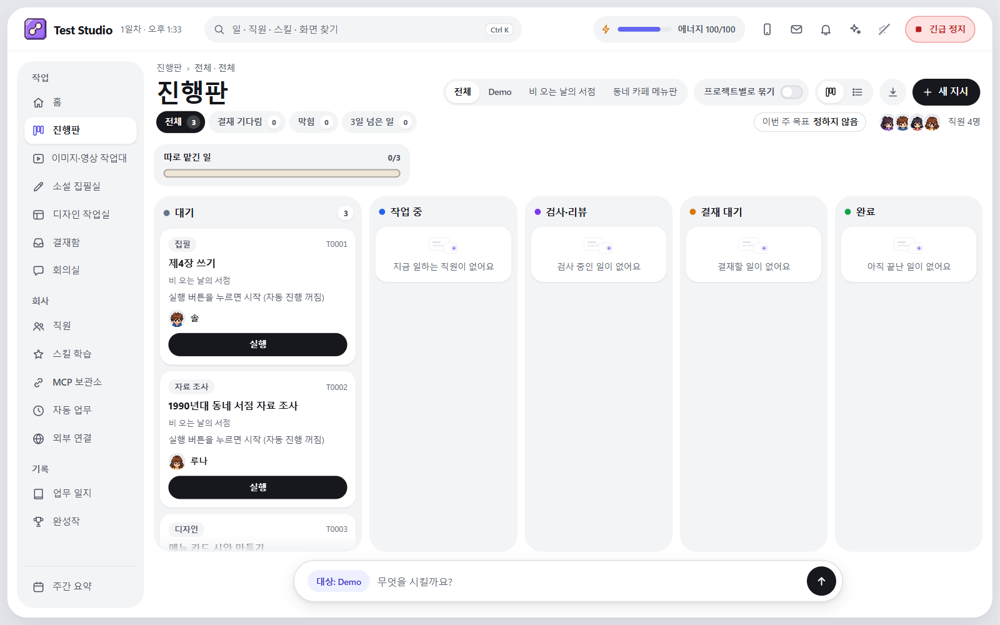

# AI Studio

AI에게 일을 맡기고 결과를 검토·승인하는 로컬 작업실입니다. 개발, 자료 조사, 소설 집필, 디자인, 이미지·영상 작업을 한 프로그램에서 관리합니다.

Python 3.11+ 표준 라이브러리 · 바닐라 JavaScript · Windows 중심 · 구독 로그인 CLI



2026-10-07 공개본은 창 크기에 맞춰 사용하는 모던 화면입니다. 오른쪽 발표 캐릭터와 도트 사무실 화면은 기본 프로그램에서 제거됐습니다. 위 화면은 개인 작업 기록을 사용하지 않은 임시 회사 예시입니다.

## 주요 기능

- **홈·진행판:** 오늘 확인할 일, 칸반·목록, 프로젝트별 보기, 빠른 찾기(Ctrl+K), 주간 요약, 결재함과 업무 기록.
- **개발·리서치:** 작업별 Git worktree, 수정 허용 범위, 후보 커밋 검증, 읽기 전용 리뷰, 결과 파일과 실행 근거.
- **소설 집필실:** 작품별 설정집·원고·연속성 기록을 읽고 기획·집필·교정 작업을 맡깁니다.
- **디자인 작업실:** 프로젝트 기획서·규칙·시안과 그림을 확인하고 디자인 작업을 맡깁니다.
- **이미지·영상 작업대:** 공식 Grok CLI의 기존 로그인으로 연결합니다. 연결 설정과 미디어 생성은 CEO 확인을 거칩니다. 고급 노드 편집기도 유지합니다.
- **프로젝트 관리:** 기존 Git 저장소 등록, 소설·디자인 프로젝트 시작, 잘못 지정한 작업 대상 변경. 기존 기록을 보존하고 새 대상에서는 확인 대기부터 시작합니다.
- **외부 MCP 연결:** 로컬 stdio/HTTP 연결과 별도의 OAuth 게이트웨이. 프로젝트별로 읽기·작업 제출·실행 시작 권한을 구분합니다. 승인·병합·완료 처리는 CEO에게 남습니다.
- **직원·모바일:** 역할별 모델과 스킬, 사용량 상한, 취소·전체 정지, 짝지은 휴대폰의 지시·결재·알림.



## 실행

준비물은 Python 3.11 이상, Git, 사용할 AI 서비스에 로그인한 CLI입니다. Godot는 게임 프로젝트 검사에만 필요하며, Node.js와 PowerShell 7은 개발 검사 도구에서 사용합니다. 별도의 Python 패키지를 설치하지 않습니다.

```powershell
git clone https://github.com/bagseunggwon30-cyber/ai-studio.git
cd ai-studio
python studio.py doctor
python studio.py serve
```

대시보드는 **http://127.0.0.1:8765/** 입니다. `studio.toml`의 실행기·도구 경로·사용량 상한을 자신의 환경에 맞게 확인하세요. 사용하는 CLI의 기존 구독 로그인으로 실행하며, 역할별 모델은 화면에서 선택합니다. Claude를 사용할 수 없는 환경에서는 리뷰 실행기를 Codex로 구성할 수 있습니다.

화면의 프로젝트 등록에서 기존 Git 저장소와 수정 범위를 지정하거나 소설·디자인 작업실에서 새 프로젝트를 시작합니다. 등록된 신뢰 검사가 없는 프로젝트는 자동 검증 없음으로 표시합니다. 신뢰 검사의 설정과 명령은 `trusted/projects/`에서 별도로 관리합니다. 제품 저장소·개인 프로젝트 설정·실행 기록은 공개본에 포함하지 않습니다.

실제 작업을 실행하면 로그인한 서비스의 구독 사용량이 소모됩니다. 알 수 없는 비용은 확정값으로 표시하지 않습니다.

## 작업과 승인

**지시 → 기획안 확인 → 구현 → 검증 → 읽기 전용 리뷰 → CEO 결재**

작업자는 허용된 경로를 작업 사본에서 수정합니다. 검증한 후보 SHA와 병합할 SHA가 일치해야 합니다. 변경되거나 접근할 수 없는 근거는 완료 근거로 인정하지 않으며, 비정상 종료 뒤 결과가 불확실한 작업을 자동 반복하지 않습니다. 자동 검증이 없는 프로젝트와 결재 대기는 검증 통과와 구분합니다.

실행 정보는 요청한 모델, 실제 실행 프로그램, 응답 메타데이터에서 확인한 모델을 구분합니다. 로그에 모델 ID가 없으면 요청 설정으로 대신 채우지 않습니다.

## 외부 AI 연결

- 로컬 Codex 등: `python studio.py mcp --user-credential` 또는 기존 감독 토큰으로 `http://127.0.0.1:8765/mcp`.
- 원격 MCP 클라이언트: 화면의 **외부 연결**에서 별도 OAuth 게이트웨이를 설정합니다. 기본 꺼짐이며 기본 바인딩은 `127.0.0.1:8767`입니다. 공개 HTTPS 주소와 터널 운영은 사용자가 별도로 준비해야 합니다.
- 프로젝트별로 읽기만, 제출, 제출+실행 시작을 선택합니다. 외부 연결은 허용된 프로젝트와 자신이 맡긴 작업의 범위를 따라야 합니다.

소스 업로드만으로 ChatGPT·Dots와 연결되지는 않습니다. 해당 클라이언트의 MCP 등록·OAuth 동의와 실제 도구 왕복을 별도로 확인해야 합니다. [MCP 서버](docs/MCP_SERVER.md) · [OAuth 게이트웨이](docs/MCP_GATEWAY.md)

## 검증

```powershell
python -X utf8 -B tools/dev/regression.py --report reports/regression.json
python -X utf8 -B tools/dev/supervisor_smoke.py --report reports/supervisor-fake.json
```

첫 명령은 전체 Python 테스트, JavaScript 문법, 진행판 및 홈·찾기·미디어·소설/디자인·게이트웨이·모바일 화면의 자동 검사를 실행합니다. 두 번째 명령은 가짜 실행기로 감독 MCP 왕복을 확인합니다. GitHub Actions도 모델 호출과 비밀정보 없이 같은 회귀 검사를 실행합니다.

이번 공개본의 정확한 통과·생략 수와 실제 화면 확인 범위는 [2026-10-07 업로드 검증](docs/verification/release-20261007.md)에 기록합니다. 가짜 실행기 검증과 실제 서비스 연결은 별개입니다.

## 문서

- [인수인계](docs/HANDOFF.md) · [작업자 규칙](AGENTS.md)
- [모던 화면 기준](docs/design/modern-ui.md) · [화면 명세](docs/design/SPEC.md)
- [회사 운영 안내](company/handbook.md)

이전 캐릭터 미리보기 자료는 개발 기록으로 남아 있지만 현재 기본 화면에서는 로드하지 않습니다.
