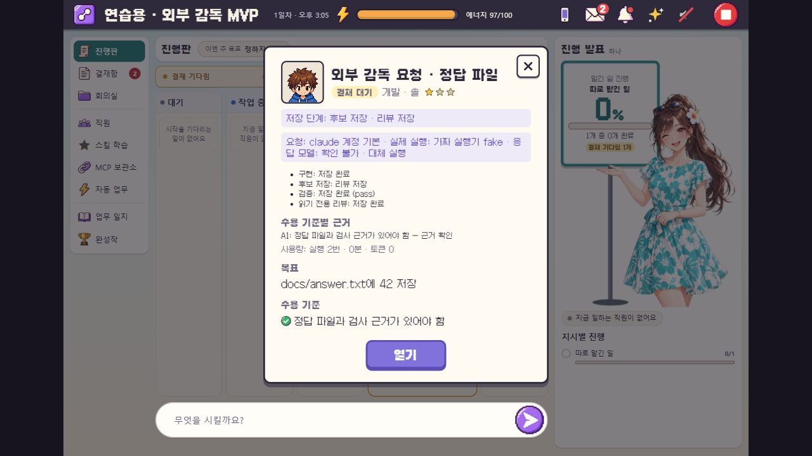
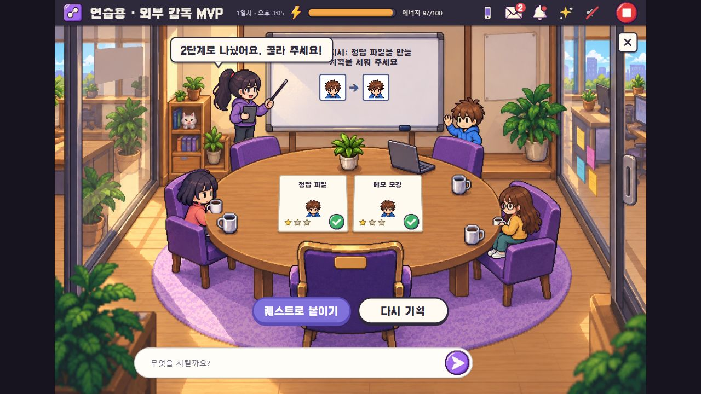

# 외부 감독 MVP 검증 결과

2026-10-03 · 로컬 `S:\AI\ai studio` · `codex/external-supervisor-mvp` · 기준 `23da5a2`.

외부 접수/API·stdio 브리지, 영속 중복 방지, 단계별 복구, 제한된 병렬화, Claude 없는 흐름, 실행기 기록, 수용 기준별 근거 검사를 구현했다. 사람의 승인과 main 병합은 기존 경계를 유지한다. 실제 외부 비서 등록과 Grok 텍스트 호출은 아직 활성화하지 않았다.

| 검사 | 결과 | 증명 범위 |
|---|---|---|
| Python 전체 회귀 | 255개 실행: 254 통과, 1 생략 · 700.447초 | 기존 모바일·MCP·작업·스킬·그림 흐름 포함. 모델은 가짜 실행기 |
| 마지막 자원 해제 보완 | 39개 실행: 38 통과, 1 생략 · 109.188초 | 완료된 도구 자원 해제, 후보 파일 범위 유지, 복구·권한·종료 |
| 진행판 계산 | 12개 통과 | 기존 카드/그룹/캐릭터 설정 계산 |
| 문법 | Python 변경 파일 18개, JS 3개 통과 | 구문 검사 |
| 정형 설계 문서 | 검사 통과 | 기능 시험과 별개인 설계 형식 검사 |
| 실제 브라우저 | 외부 기획 제출 → 실행 대기 → 버튼 실행 → 기획 결재 대기 확인 | 임시 회사·가짜 모델. 완료 근거/실행기 화면, 콘솔 경고·오류 0 |
| 별도 stdio 프로세스 | 6개 도구 조회, HTTP 결과 왕복 성공 | 다른 작업 폴더에서 브리지 실행. 검증 true, 승인 false |
| 실제 Codex | 승인받은 읽기 전용 1회 성공 · 9초 | CLI 0.160.0, 입력 17002·출력 15토큰. 응답의 정확한 모델 ID는 확인 불가 |
| Grok 연결 점검 | CLI 1.0.41, grok.com 로그인, 목록의 grok-4.7 확인 | 실제 생성 호출 0회. 기본 모델 grok-build, API 가용성 미확인 |
| doctor | 실패 없음, Claude 비활성 경고 | 설치·인증·필수 옵션 점검. 과거 자가 검사 기록은 새 실행 결과로 계산하지 않음 |

전체 검사는 마지막 공유 자원 해제 보완 직전에 시작됐다. 그 변경과 새 테스트는 마지막 39개 검사에서 확인했다. 두 검사 수는 겹치므로 합산하지 않는다. 현재 전체 테스트 목록은 256개다. 생략한 검사는 Windows에 적용되지 않는 POSIX 프로세스 그룹 검사다. 마지막 검증 소스 해시는 `mvp-report.json`에 남겼다.

`board_sim.js`는 기존 제품이 최근 완료 카드 5개를 보여 주는데 8개를 기대하던 옛 테스트를 바로잡았다. 제품의 표시 개수는 유지했다. 앞서 발견했던 실행 ID 형식, 가짜 실행기 정보 처리, 스킬 결재 카드의 불필요한 잠금, 완료된 MCP 자원 점유 문제는 수정 후 해당 검사에서 통과했다.

## 아직 확인하지 않은 것

- 실제 Codex로 코드 구현·QA·리뷰·최종 승인까지 전체 흐름: 실행 안 함. 승인된 실제 호출은 읽기 전용 1회뿐이다.
- Grok 텍스트 실행: 이미지 전용 규칙 변경 승인과 CLI의 도구/MCP 제한 확인이 필요하다. 유료 API로 전환하지 않았다.
- 외부 비서의 실제 MCP 등록·호출: 실행 안 함. 연결 대상과 프로젝트 권한을 정하고 CEO가 토큰 등록을 승인한 뒤 도구 왕복을 확인해야 한다.
- 실제 휴대폰·LAN·Tailscale: 실행 안 함. 기존 모바일 API 회귀 검사만 수행했다.
- 외부 업로드 등의 결과를 원격 시스템에서 대조하는 범용 복구: 미구현. 완료 여부가 불확실하면 보존하고 멈춘다.

실제 회사 설정·데이터·제품 저장소·신뢰 테스트는 수정하지 않았다. 새 의존성, main 병합, 외부 배포, localhost 공개, 실제 자격 증명 발급은 없다. 원시 로그는 로컬에 남기고 Git에서 제외했다. 공개 문서에는 임시 회사 화면과 연결 결과 요약만 포함한다.

실행 방법과 파일별 구현 범위: [외부 감독 MVP](../SUPERVISOR_MVP.md).

